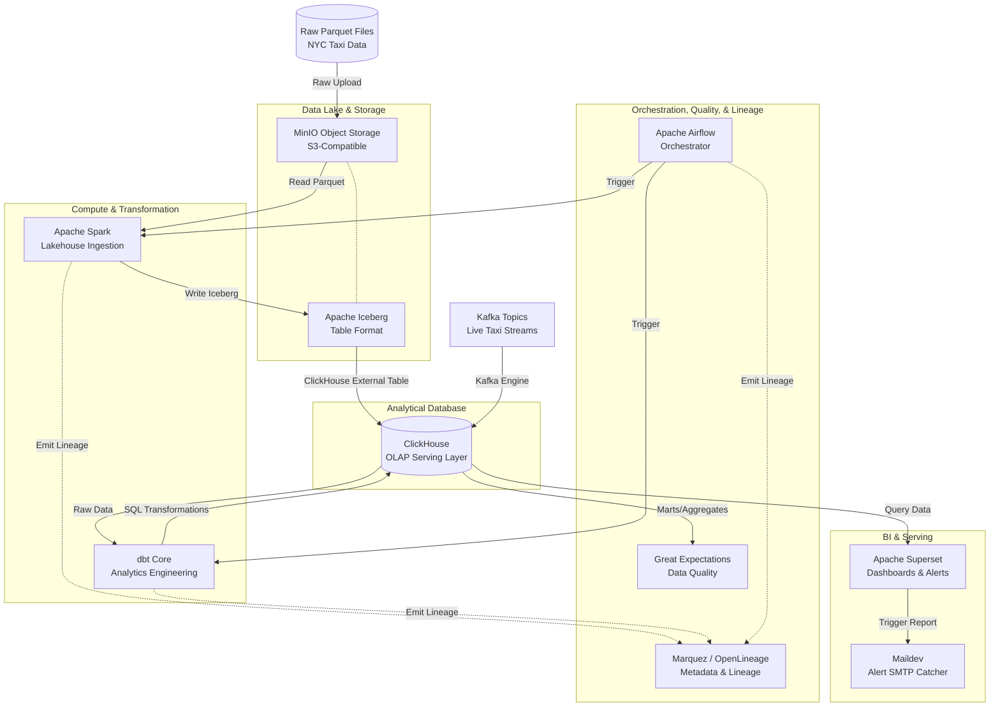

# Modern Data Stack: End-to-End Architecture

This document provides a comprehensive technical overview of the end-to-end data platform, detailing the flow of data from ingestion to consumption, the specific tools used, and how they integrate.

## 1. High-Level Architecture Diagram

---

## 2. Component Deep Dive

### 2.1 Storage & Data Lakehouse (`MinIO` + `Apache Iceberg`)
- **MinIO** acts as the localized S3-compatible object storage layer. It holds both the raw, unprocessed Parquet files downloaded from the NYC Taxi dataset, and the subsequent Iceberg data files.
- **Apache Iceberg** provides ACID transactions, schema evolution, and time-travel on top of the raw Parquet files residing in MinIO. It transforms a standard data lake into a structured "Lakehouse".

### 2.2 Compute & Ingestion (`Apache Spark` + `Kafka`)
- **Batch Processing (PySpark)**: Spark jobs read the raw Parquet files from MinIO, process them into the Iceberg table format, and write them back out to MinIO. 
- **Stream Processing (Apache Kafka)**: Live or micro-batch streams of taxi events can bypass Spark and flow directly into ClickHouse using ClickHouse's native Kafka Table Engine.

### 2.3 Data Warehousing (`ClickHouse`)
ClickHouse serves as the ultra-fast OLAP (Online Analytical Processing) engine for the stack.
- It can read Iceberg tables natively via integration engines.
- It stores analytical marts (created by dbt) in highly optimized **MergeTree** and **SummingMergeTree** tables.
- Its columnar architecture allows it to serve billions of rows to the BI layer with sub-second latency.

### 2.4 Transformation & Analytics Engineering (`dbt`)
Data transformation is handled in-warehouse using **dbt Core** (with the `dbt-clickhouse` adapter). The DAG follows standard analytics engineering best practices:
1. **Staging (`stg_`)**: 1:1 views of the raw tables (renaming and casting types).
2. **Intermediate (`int_`)**: Logic-heavy views (joining trips to zones, calculating durations and tip percentages).
3. **Marts (`fct_` / `dim_` / `agg_`)**: Physicalized ClickHouse `MergeTree` tables ready for consumption.

### 2.5 Data Quality (`Great Expectations`)
While dbt handles basic boolean SQL tests (e.g., `not_null`, `unique`), **Great Expectations (GX)** acts as the secondary, advanced validation layer.
- Connects directly to ClickHouse via SQLAlchemy.
- Runs complex, distributional "Expectation Suites" (e.g., checking if fare distributions fall within expected statistical bounds or enforcing cross-column physical limits).
- Generates HTML **Data Docs** summarizing data health over time.

### 2.6 Data Lineage (`OpenLineage` + `Marquez`)
To maintain complete observability, the stack utilizes **Marquez** (the reference implementation of the OpenLineage standard).
- **dbt** uses the `openlineage-dbt` wrapper to emit `START` and `COMPLETE` events for every SQL model run.
- **Spark** is configured with an OpenLineage Java agent/listener to emit physical execution plans and dataset I/O.
- **Airflow** automatically instruments tasks to tie the DAG structure to the data lineage.
- Marquez aggregates this into a visual graph, allowing engineers to trace a bad row in a Superset dashboard all the way back to a corrupted raw Parquet file.

### 2.7 Orchestration (`Apache Airflow`)
Airflow acts as the central scheduler and trigger mechanism for the platform.
- It triggers the PySpark ingestion jobs.
- It triggers the downstream `dbt build` command.
- It handles failure retries and dependencies between the Lakehouse and the Warehouse.

### 2.8 Business Intelligence & Alerting (`Apache Superset`)
Superset is the presentation layer for end-users.
- Connects to ClickHouse via the `clickhouse-sqlalchemy` driver.
- Queries the physical `dbt` marts (fact tables and aggregated materialized views) to populate interactive dashboards (Time-series, Geospatial Heatmaps).
- Built-in Alerting and Reporting runs in the background (via Celery), pushing metric anomalies or scheduled CSV reports out via SMTP (caught locally for testing by `Maildev`).

---

## 3. Network Architecture (Docker)
The entire stack runs locally via Docker Compose, segmented across isolated networks:
- `minioandclickhouse_warehouse_net`: Connects the Storage layer (MinIO) directly to the Warehouse (ClickHouse) for rapid I/O.
- `kafkaandclickhouse_default`: Connects the streaming brokers directly to ClickHouse.
- `governance-net`: The overarching network that allows Airflow, Superset, and Marquez to communicate with each other, and acts as the bridge connecting them into the ClickHouse network.
